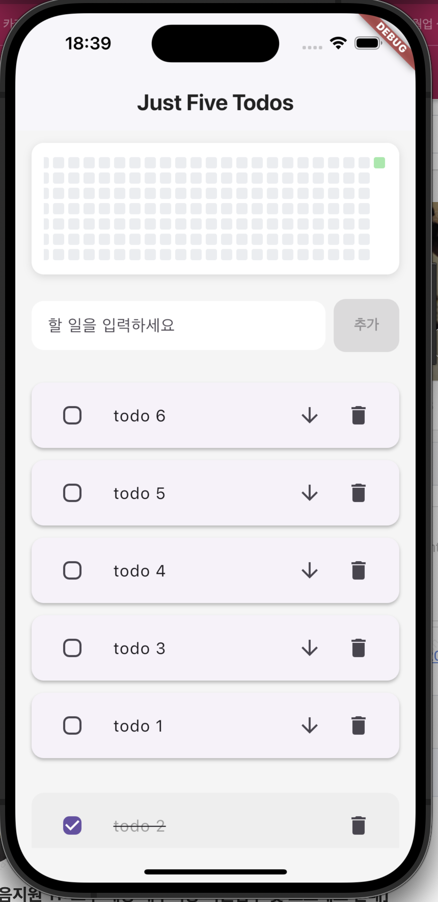

# Just Five Todos



Flutter로 만든 심플하고 직관적인 Todo 앱입니다. 

## 주요 기능
- 할 일 추가, 완료, 삭제, 미루기(맨 뒤로 보내기)
- 최근 5개의 할 일만 표시, 완료한 일은 별도 표시
- 완료한 Todo를 1년치 GitHub 스타일 히트맵으로 시각화
- 직관적이고 미니멀한 UI

## 스크린샷
(앱 실행 화면을 여기에 첨부하세요)

## 개발 및 실행 방법

### 1. 환경 준비
- [Flutter 설치](https://docs.flutter.dev/get-started/install)
- Android Studio, VSCode 등 Flutter 개발 환경 권장

### 2. 패키지 설치
```
flutter pub get
```

### 3. 앱 실행
- 에뮬레이터 또는 실제 기기에서 실행
```
flutter run
```

### 4. 빌드
- Android APK 빌드:  
  `flutter build apk`
- iOS 빌드:  
  `flutter build ios`
- Web 빌드:  
  `flutter build web`

## 📦 Android 번들(AAB) 빌드 방법

구글 플레이 스토어에 앱을 배포하려면 AAB(Android App Bundle) 파일을 빌드해야 합니다.

1. 의존성 설치(최초 1회)
   ```sh
   flutter pub get
   ```
2. 번들 빌드 명령 실행
   ```sh
   flutter build appbundle --release
   ```
3. 생성된 파일 위치
   - `build/app/outputs/bundle/release/app-release.aab`

이 파일을 구글 플레이 콘솔에 업로드하면 됩니다.

## 🔢 앱 버전 및 빌드 넘버 변경 방법

앱의 버전(versionName)과 빌드 넘버(versionCode)는 `pubspec.yaml` 파일에서 관리합니다.

- 예시:
  ```yaml
  version: 1.0.0+1
  ```
  - `1.0.0` : 사용자에게 보이는 앱 버전 (versionName)
  - `1`     : 내부적으로 사용하는 빌드 넘버 (versionCode)

### 버전 변경 방법
1. `pubspec.yaml` 파일을 열고 `version:` 값을 수정합니다.
   - 예시: `version: 1.0.1+2`
2. 빌드 시 자동으로 반영됩니다.
   - AAB 빌드 예시:
     ```sh
     flutter build appbundle --release
     ```
   - 또는 명령어로 직접 지정할 수도 있습니다:
     ```sh
     flutter build appbundle --release --build-name=1.0.2 --build-number=3
     ```

> **참고:**
> - versionCode(+)는 항상 이전보다 큰 값이어야 구글 플레이 콘솔에서 업로드가 가능합니다.
> - iOS는 version:의 앞부분(1.0.0)이 CFBundleShortVersionString, 뒷부분(1)이 CFBundleVersion에 반영됩니다.

## 폴더 구조
- `lib/main.dart` : 앱의 메인 로직 및 UI
- `test/` : 위젯 테스트 예시
- `android/`, `ios/`, `web/`, `macos/`, `windows/`, `linux/` : 각 플랫폼별 빌드 파일

## 기여 방법
1. 이슈/버그/개선사항은 GitHub Issue로 등록해주세요.
2. PR(Pull Request) 환영합니다!

## 라이선스
MIT License
